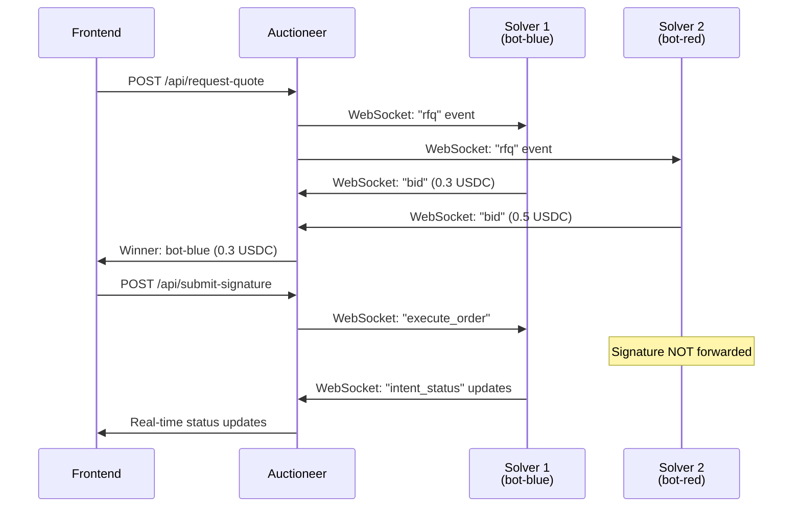
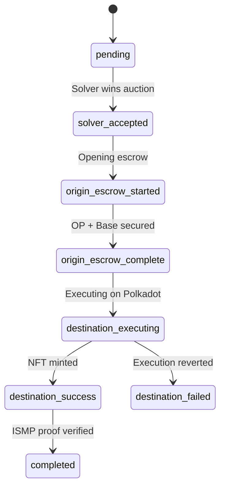

# OmniSpend Auctioneer

The auctioneer is the central coordinator for the OmniSpend protocol. It matches user cross-chain payment intents with competing solver bots via a Just-In-Time (JIT) auction.

## Overview

The auctioneer serves as the **RFQ (Request for Quote) engine**:

1. Receives payment intents from frontend (which origin chains, how much, destination)
2. Broadcasts RFQ to all connected solver bots via WebSocket
3. Runs a brief auction (default 500ms) where solvers submit competitive bids
4. Selects the **lowest fee** bid as the winner
5. Forwards user signatures **only** to the winning solver
6. Tracks execution status and pushes real-time updates to users

## Architecture



## REST API Endpoints

### POST `/api/request-quote`

Request a quote from solvers.

**Request:**
```json
{
  "requestId": "rfq-123456789",
  "user": "0xUserAddress...",
  "legs": [
    { "chain": "OP Sepolia", "chainId": 11155420, "amount": "1000" },
    { "chain": "Base Sepolia", "chainId": 84532, "amount": "500" }
  ],
  "destination": { "chain": "Polkadot Paseo", "chainId": 420420417 },
  "totalOutputAmount": "1500",
  "target": "0xNFTContract...",
  "callData": "0x..."
}
```

**Response:**
```json
{
  "requestId": "rfq-123456789",
  "winner": {
    "solverAddress": "0xSolver...",
    "solverName": "bot-blue",
    "fee": "0.3"
  },
  "allBids": [
    { "solverAddress": "0x...", "solverName": "bot-blue", "fee": "0.3" },
    { "solverAddress": "0x...", "solverName": "bot-red", "fee": "0.5" }
  ],
  "auctionDurationMs": 500
}
```

### POST `/api/submit-signature`

Submit user signatures to be forwarded to winning solver.

**Request:**
```json
{
  "requestId": "rfq-123456789",
  "winnerAddress": "0xSolver...",
  "signedPayload": { ... },
  "nftName": "Cool NFT #123",
  "user": "0xUserAddress...",
  "legs": [...],
  "destination": {...},
  "totalOutputAmount": "1500"
}
```

**Response:**
```json
{
  "success": true,
  "message": "Signature forwarded to winning solver",
  "intentId": "rfq-123456789"
}
```

### GET `/api/intent/:requestId`

Get current status of an intent (polling fallback).

**Response:**
```json
{
  "requestId": "rfq-123456789",
  "status": "origin_escrow_complete",
  "currentStep": 3,
  "steps": [
    { "status": "pending", "message": "Intent submitted...", "timestamp": 1234567890 },
    { "status": "solver_accepted", "message": "Solver accepted order", "timestamp": 1234567891 },
    { "status": "origin_escrow_started", "message": "Opening escrow on OP", "timestamp": 1234567892 }
  ],
  "legs": [...],
  "totalOutputAmount": "1500",
  "winnerName": "bot-blue"
}
```

### GET `/api/intents/:userAddress`

Get all intents for a specific user.

### GET `/health`

Health check endpoint.

**Response:**
```json
{
  "status": "ok",
  "connectedSolvers": 2,
  "connectedClients": 5,
  "activeAuctions": 0,
  "trackedIntents": 3
}
```

## WebSocket Events

### Solver Namespace (`/solver`)

Solvers connect here to receive RFQs and submit bids.

**Connection:**
```
ws://localhost:3002/solver?address=0xSolver&name=bot-blue
```

**Events received by solver:**

| Event | Payload | Description |
|-------|---------|-------------|
| `rfq` | `RFQRequest` | New RFQ to bid on |
| `execute_order` | `{ requestId, signedPayload }` | Winner receives signatures |

**Events emitted by solver:**

| Event | Payload | Description |
|-------|---------|-------------|
| `bid` | `{ solverAddress, solverName, fee, requestId }` | Submit a bid |
| `intent_status` | `{ requestId, status, message, txHash? }` | Execution status updates |

### Client Namespace (`/client`)

Frontend connects here to receive real-time updates.

**Connection:**
```
ws://localhost:3002/client?address=0xUserAddress
```

**Events received by client:**

| Event | Payload | Description |
|-------|---------|-------------|
| `intent_update` | `{ requestId, status, message, txHash?, step }` | Real-time intent status |

**Events emitted by client:**

| Event | Payload | Description |
|-------|---------|-------------|
| `subscribe_intent` | `requestId` | Subscribe to intent updates |
| `unsubscribe_intent` | `requestId` | Unsubscribe from updates |

## Intent Status Flow



## Configuration

Environment variables (see `.env.example`):

| Variable | Default | Description |
|----------|---------|-------------|
| `PORT` | `3001` | HTTP server port |
| `AUCTION_TIMEOUT_MS` | `500` | How long to wait for solver bids |

## Setup

```bash
# Install dependencies
npm install

# Configure environment
cp .env.example .env
# Edit .env with your settings

# Development
npm run dev

# Production
npm run build
npm start
```

## Running

```bash
# Development mode (with hot reload)
npm run dev

# Production mode
npm start

# Health check
curl http://localhost:3001/health
```

## Testing

```bash
# Test quote endpoint
curl -X POST http://localhost:3001/api/request-quote \
  -H "Content-Type: application/json" \
  -d '{
    "requestId": "test-rfq-1",
    "user": "0x1234...",
    "legs": [{ "chain": "OP Sepolia", "chainId": 11155420, "amount": "1000" }],
    "destination": { "chain": "Polkadot Paseo", "chainId": 420420417 },
    "totalOutputAmount": "1000",
    "target": "0xNFT",
    "callData": "0x"
  }'
```

## Integration with Frontend

```typescript
// Connect to auctioneer
const response = await fetch("http://localhost:3001/api/request-quote", {
  method: "POST",
  headers: { "Content-Type": "application/json" },
  body: JSON.stringify(rfqPayload),
});

const { winner } = await response.json();

// Later, submit signatures
await fetch("http://localhost:3001/api/submit-signature", {
  method: "POST",
  headers: { "Content-Type": "application/json" },
  body: JSON.stringify({
    requestId,
    winnerAddress: winner.solverAddress,
    signedPayload: userSignature,
    // ... other fields
  }),
});

// Listen for updates via WebSocket
const socket = io("http://localhost:3002/client", {
  query: { address: userAddress },
});

socket.on("intent_update", (data) => {
  console.log("Status:", data.status, data.message);
});
```
